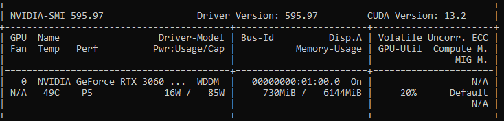
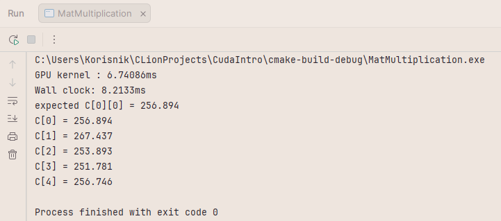
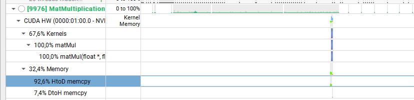
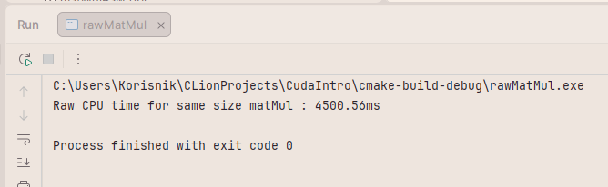

## CUDA Matrix Multiplication — Naive vs CPU Baseline

Personal project benchmarking GPU vs CPU performance on matrix multiplication, written in CUDA C++.

---

### Hardware

---

### Results

| Implementation | Time |
|---|---|
| CPU (single-threaded) | ~4500ms |
| GPU naive (CUDA) | ~6.76ms |
| **Speedup** | **~666x** |

---

### Naive CUDA kernel

Launches one thread per output element. Each thread independently computes its dot product by reading directly from global memory.

---

### Nsight Systems profile — naive kernel

67.6% of GPU time is compute, 32.4% is memory transfers. Of the memory time, 92.6% is host→device (copying A and B to GPU) and only 7.4% is device→host (copying result back).

---

### CPU baseline

Single-threaded triple nested loop, same matrix dimensions (718×1024 × 1024×556).

---
### TODO: Tiled matrix multiplication

The naive kernel reads directly from global memory on every multiply. Tiling loads blocks of A and B into shared memory (~100x faster than global), which should reduce global memory reads by a factor of `TILE_SIZE` and significantly improve kernel time.